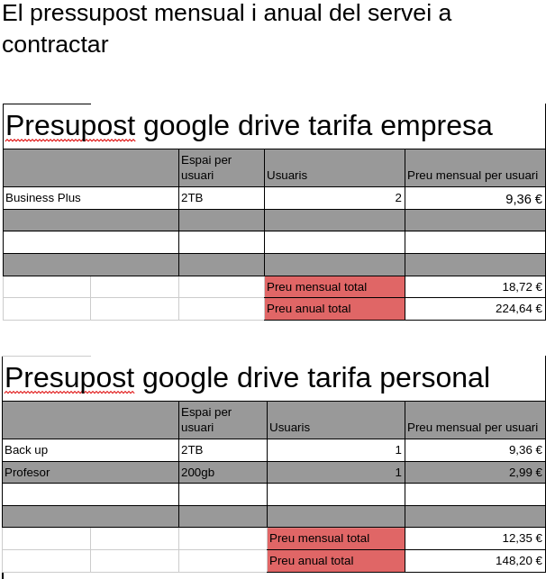
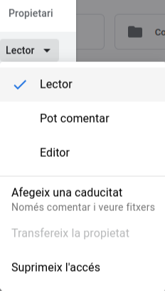

# Activitat practica

## Índex

* Enunciat del cas pràctic 1	
* El pressupost mensual i anual del servei a contractar	
* Creació de les unitats compartides BACKUP i DOCUMENTS i permisos assignats a cada tipus d’usuari/a
* Exemples d’ús de fer un backup per part de l’administrador/a

## Enunciat del cas pràctic 1

Com a encarregat/da del departament d’informàtica de la teva empresa tens la obligació de fer les còpies de seguretat de la documentació de l’empresa, actualment les fas en una màquina local situada a les mateixes oficines on està l’empresa. La setmana passada el disc dur que feies servir per fer les còpies de seguretat es va negar a funcionar i s’ha perdut tota la informació que hi havia acumulada. No ha passat res perquè la documentació la guarden els treballadors i treballadores en local també, però una suor freda t’ha recorregut el cos…

Com a persona responsable decideixes informar als teus superiors i proposar una solució d’emmagatzematge al núvol, a més de la que feies servir actualment, per més seguretat. Estudies utilitzar un compte de Google Drive.

Les premisses que s’han de cumplir son diverses: 

● Hi ha d’haver una carpeta per a backup amb capacitat per a un màxim de 2TB. 

● Aquesta carpeta serà accessible només per a l’usuari/a administrador. 

● Decideixes que és una bona idea tenir una carpeta extra amb la documentació necessària per a tots/es els empleats/des que serà de lectura i escriptura per a l’administrador/a i només de lectura per a l’usuari/a. 

● Creareu un accés per la unitat compartida DOCUMENTS als escriptoris dels usuaris/es. 

● També creareu un accés per a la unitat BACKUP on deixareu les Perquè aquesta és una bona solució al nostre problema?

Aquesta és una bona solució al nostre problema ja que no necessitarem un dispositiu físic al que no caldrà fer-li manteniment de ningun tipus, ademés no tindrem la possibilitat de que es torni a trencar ja que al núvol aquest arxius estan més segurs.

A més a més podrem usar aquest sistema per passar arxius de forma més fàcil entre professors i es podrà controlar tota la informació i posar permisos de forma més fàcil per al administrador

## Creació de les unitats compartides BACKUP i documents i permisos assignats a cada tipus d’usuari/a.

A la carpeta de Backup els professors domés tindran accés a veure els arxius. Després a la carpeta de documents feta per als professors i alumnes, donariem permisos de editor als professors i lector als alumnes

